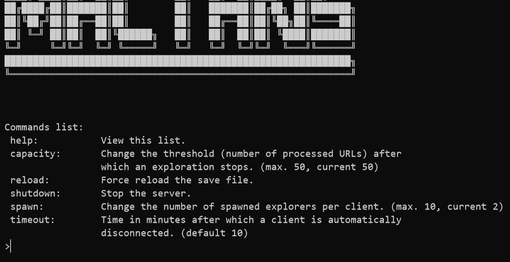
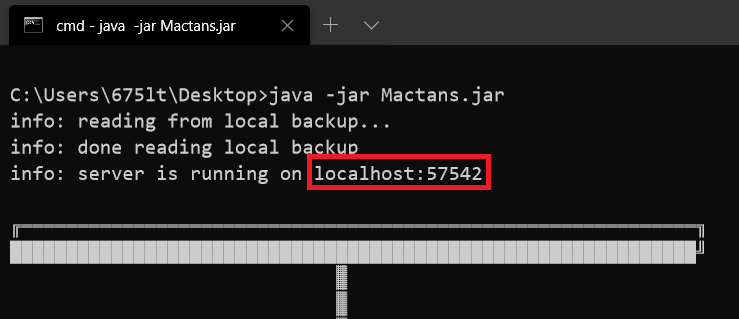
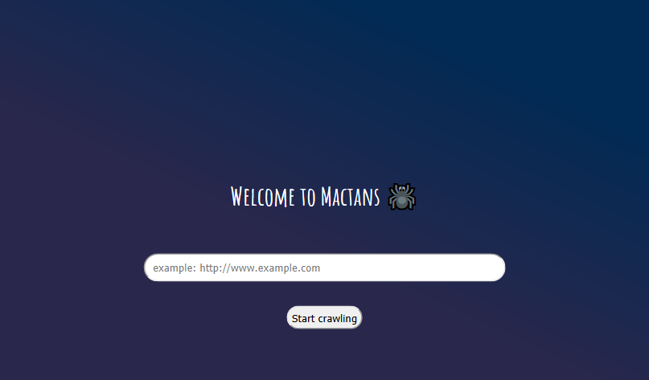
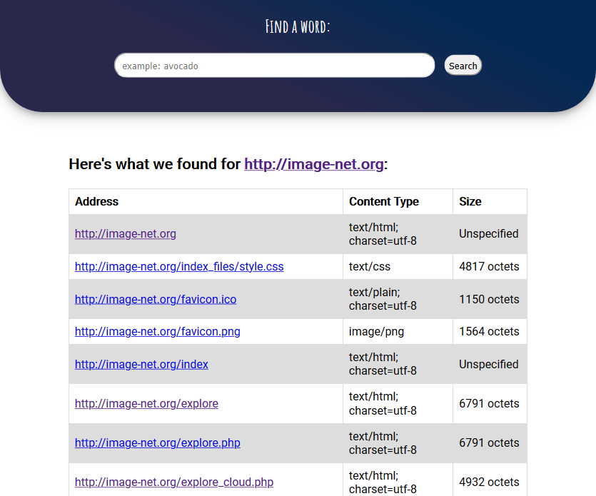
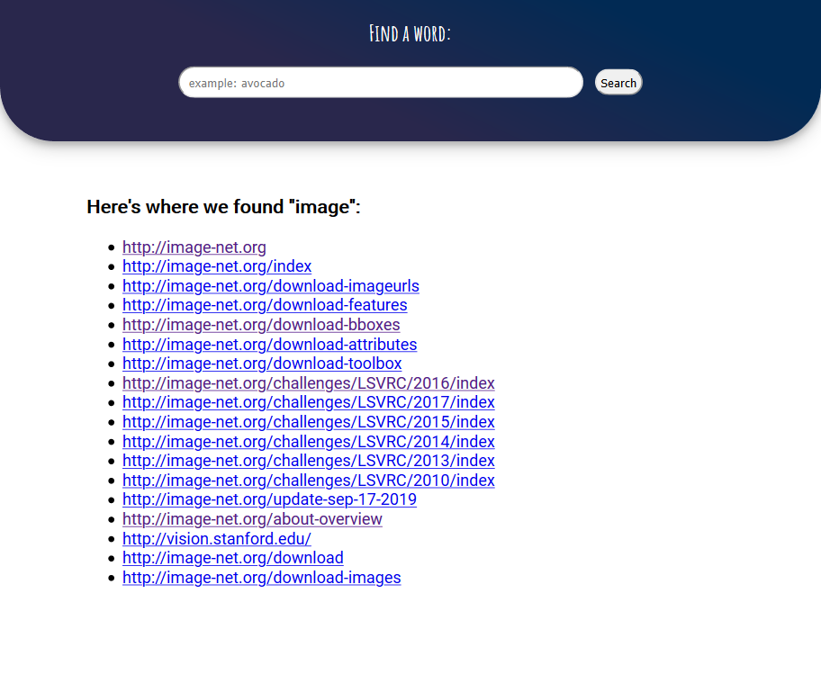

# Mactans 🕷️ **:** Multi-Client Web server, made for Web crawling


###### (For a better visual representation, this document was formatted with Markdown)

Mactans is a Web crawler made with pure Java and with NO external libraries.

A [web crawler](https://en.wikipedia.org/wiki/Web_crawler) is: 
>"an Internet bot that systematically browses the World Wide Web, typically for the purpose of Web indexing". 

Mactans provides exactly that and more; it comes with a hand-written Java **Web server that can handle multiple clients at once**, and send for each one of them, as a result, a Web interface accessible via a Web browser, where one can **submit a Web address** and receive in return **the list of URLs that were found during the parsing of HTML elements and the indexing of the words on the Webpage**. Furthermore, users can choose to search for any word and **receive the list of Web addresses where it was encountered**. It is worth mentioning that **the server can in fact index all the languages that fall under the UTF-8 character encoding**. 

## Installation
You can either copy the project into your IDE or use the provided runnable Jar.

### Requirements 
* This project was made using **JDK 13.0.2**, and it may not work properly (or at all) with older JREs.
* Some directories (namely **/data** and it's sub-folders) are required for the program to function as it should, since they contain HTML template-documents for the Web server. Some also work as a place to store the back-up file for the server, and it is unadvised to remove them from the program's root directory.
 


## Usage
### Running the program
#### Command line prompt (no support for command line arguments atm)

```bash
java -jar Mactans.jar
```
(make sure the **/data** folder is in the same directory as the Jar file)

#### IDE
From an IDE, run the **Launcher.java** Java class.

### Changing some server variables
The program offers a minimal commands line interface to perform some modifications on the server on the go while it's running! Bellow is the list of commands that are currently supported: 

| Command | Description |
| --- | --- |
| help | View this list |
| capacity | Change the threshold (number of processed URLs) after which an exploration stops |
| reload | Force reload the local save file |
| shutdown |  Stop the server |
| spawn |  Change the number of spawned explorers per client |
| timeout |  Time in minutes after which a client is automatically disconnected (**-1** to remove the timeout) |

#### Example:


(It is worth noting that these modifications can also be made directly through the server's source code, but it is highly advised to do so through the CLI as it can handle variables' miss-assignments better. Hard-coded max. values should be changed from the **Server.java** class.)

### Using what the program has to offer
When the server is first started, it writes to its output the **address:port** (usually **localhost:port**) combination that clients can connect to via a Web browser.
Depending on your network configuration, clients should be able to connect to the server from devices other than the local host by querying the server's IP address and the port number that it is listening on: **IP:port**.

#### Example: 


Clients are greeted with a Webpage, where lies an input box and a submit button, asking them to insert a URL.

#### Example: 


After getting the necessary information from the URL that was submitted by the client, the server sends a Webpage with a list containing for each address that was encountered during the scan, its type and its size.
Scans for words from the index can also be executed from the same Webpage.

#### Example: 


Index scans typically lead to the word search result page where more search queries can be executed. Scans are not case sensitive. ex: searching the word **tomato** would typically result in any match case of that word (**Tomato**, **TOMATO**, **ToMAtO**, etc...).

#### Example: 


## Inner workings

#### Connection
Technically speaking, the server listens on two ports. One socket is reserved for the clients while the other is reserved for the explorers. Thanks to Java NIO and the non-blocking mode for the sockets, connections from the clients and the explorers are handled separately both at the same time, and the server continues to execute even if one of the connections block.

#### Clients management
Clients communicating with the server are uniquely identified and are treated seamlessly and separately. When a client first connects to the server, it gets an ID assigned to its channel which later helps sending results to the right person. To help reduce the load and get rid of unnecessary data being stored on the server, clients are disconnected and their search data is removed after a period of time that can be updated or disabled through the server's CLI .

#### Explorers management
Much like the clients, when it comes to the connection, the server and the explorers communicate via network. Every explorer is handled separately and asynchronously. When an explorer is first created, it sends a request to the server asking to be attached to a client's ID, that if any are connected. It then waits for server queries that are going to be, from this point onwards, URLs to be explored. The life-cycle of an explorer can be broken down as follow:

* Wait for server requests
* Receives a URL
* Send the address an HTTP request in order to retrieve the HTTP header
* Scan the header and parse the necessary content fields 
* If the address resembles an HTML document, download its content and parse it into two lists, one for words and the other for URLs
* If the address resembles a non-HTML document, skip the download and parsing part and only keep the HTTP header's content data
* Make a WebDocument object that contains data from the scan and prepare it for serialization
* Serialize the object and send it to the server via the explorers' port
* Standby and listen for more server requests


#### Parsers
The HTML parser is hand made, and is split between two Java classes: **HTMLScrambler.java** and **FileOperations.java**. Generally speaking what it does is it takes HTML data and matches it to HTML tags' patterns in the parser Java class. For word parsing, it starts by removing any scripts and style/CSS elements, followed by comments, actual HTML tags and entities, and then deletes any punctuation that is unnecessary for the index. It finally splits the words and nicely returns them in a list of Strings. 

As for URL extraction, the parsing process differs in that no HTML elements are removed during the scan for href elements, they are retrieved directly as the scanner goes through the HTML data, and returned in a list of Strings when its finished. This parser is based on the [RCF2396's](https://www.ietf.org/rfc/rfc2396.txt) specification for the [Uniform Resource Identifier](https://en.wikipedia.org/wiki/Uniform_Resource_Identifier). 

#### Serialization
Serialization code is also hand made and is done by the **WebDocumentOperations.java** Java class. It takes care of turning WebDocument objects into Strings to be sent to the server and converting received Strings into WebDocument objects. No specific file format was used for formatting the serialized objects, fields are coded into blocks of text that are separated by delimiters, it's as simple as that. 

#### Index
The indexing for each client's result is done by a separate thread managed by the server called **WorkerThread.java**. For each word of every explored WebDocument, de-serialized by the server, the thread maps it to the list of URLs where it was encountered.

#### Backup
To prevent unnecessary explorations, the server keeps a local backup, located in **/data/index/backup**, for every address that was ever explored. This file is updated —using the same 'WebDocument to String' serialization code mentioned before— with results from every exploration ever made and is read at server start-up. It is possible to reload the backup file while the server is running. This part can drastically improve response times.

## Final notes & project status
* On a positive note, this project fulfills everything that was submitted in [this](https://eprel.u-pec.fr/eprel/claroline/backends/download.php?url=L1Byb2pldDIwMjAucGRm&currentTime=1587762515&cidReset=true&cidReq=9358) description, and more! :) 
* Explorers do in fact take redirects (301 and 302 HTTP codes) into account. Redirect URLs are automatically added to the queue, and are explored during the rest of the exploration.

**Slightly negative notes ahead:**
* Clients connecting to the explorers' port is neither advised nor is it handled by the server at the moment.
* CLI server updates take effect for new clients only, it doesn't effect those that have already been processed. (as it should)
* Some Web browsers may unexpectedly reset the connection with the server which may cause it to close its channel with that client. (highly unlikely to happen, but still possible)
* Part of the URL and word search's spell checking is done on the client's side with a small JavaScript code in the Webpage. Please keep that in mind if you are using legacy browsers, as scripting may not be supported by old Web browsers or it may be disabled by default.
